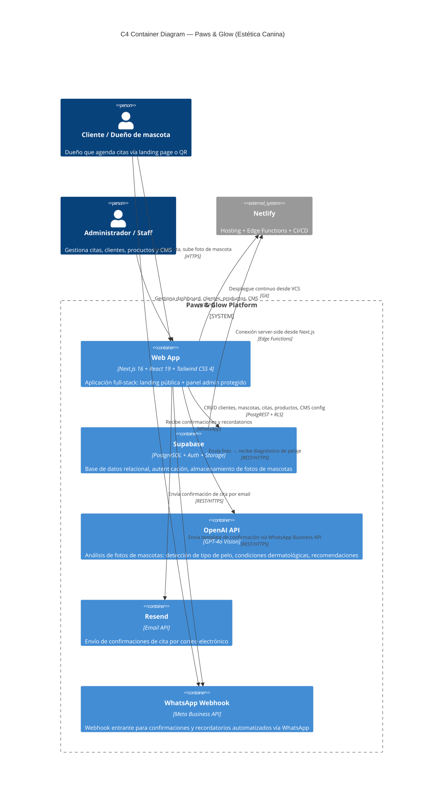

# Arquitectura — Paws & Glow (C4 Nivel 2: Diagrama de Contenedores)

## Contexto de Negocio

Paws & Glow digitaliza el flujo completo de una estética canina:

1. **Landing pública**: showcase de servicios, reseñas, formulario inteligente de citas
2. **Diagnóstico IA**: análisis de fotos de mascotas con OpenAI Vision para recomendar tratamientos personalizados
3. **Panel admin**: gestión de citas, clientes, mascotas, productos, CMS drag-and-drop, form builder
4. **Notificaciones omnicanal**: confirmaciones por email (Resend) + WhatsApp (Meta API)

## Stack Técnica

| Capa | Tecnología |
|------|-----------|
| **Frontend** | Next.js 16 (App Router), React 19, Tailwind CSS 4, Radix UI, react-hook-form + Zod |
| **3D** | React Three Fiber + Drei + GSAP (modelo canino interactivo en landing) |
| **Backend** | Next.js Server Actions + API Routes |
| **Base de Datos** | Supabase PostgreSQL con Row Level Security |
| **Auth** | Supabase Auth (magic link / email) |
| **Storage** | Supabase Storage (fotos de mascotas) |
| **AI** | OpenAI GPT-4o Vision API |
| **Email** | Resend API |
| **WhatsApp** | Webhook entrante + WhatsApp Business API |
| **Hosting** | Netlify con Edge Functions |
| **PWA** | Service Worker + Manifest (offline-ready) |

## Decisiones de Arquitectura (ADRs)

### ADR-001: Supabase como Backend-as-a-Service
**Decisión:** Usar Supabase en lugar de un backend custom.
**Justificación:** PostgreSQL con RLS, auth integrada, storage y realtime en un solo servicio. Elimina la necesidad de un backend separado para un MVP. Las Server Actions de Next.js manejan la lógica de negocio directamente sobre Supabase.

### ADR-002: Server Actions sobre API Routes para operaciones de escritura
**Decisión:** Priorizar Server Actions para mutaciones (crear cita, actualizar productos) y API Routes para webhooks externos.
**Justificación:** Server Actions simplifican el manejo de formularios sin necesidad de estado cliente. Los webhooks requieren endpoints HTTP tradicionales verificables por servicios externos.

### ADR-003: OpenAI Vision para diagnóstico de pelaje
**Decisión:** Usar GPT-4o Vision para analizar fotos de mascotas y generar recomendaciones de grooming.
**Justificación:** Diferenciador competitivo. La IA detecta tipo de pelo, condiciones visibles y sugiere servicios específicos, creando confianza y reduciendo fricción en la selección de servicios.

### ADR-004: CMS integrado (no headless externo)
**Decisión:** Construir un CMS admin panel integrado en Next.js en lugar de usar Strapi/Contentful.
**Justificación:** Para un negocio de estética canina con contenido estático limitado (servicios, hero, reseñas), un CMS externo añade complejidad innecesaria. La tabla `landing_config` con JSONB da flexibilidad suficiente.

---

_Generado por Kurama 🍥 — 2026-04-29_
