# Diagramas de Secuencia — Paws & Glow

> 15 flujos completos: 4 Landing, 8 Backoffice, 3 API

---

## 🌐 LANDING (Flujos Públicos)

### FLOW-L1: Navegación de Landing Page

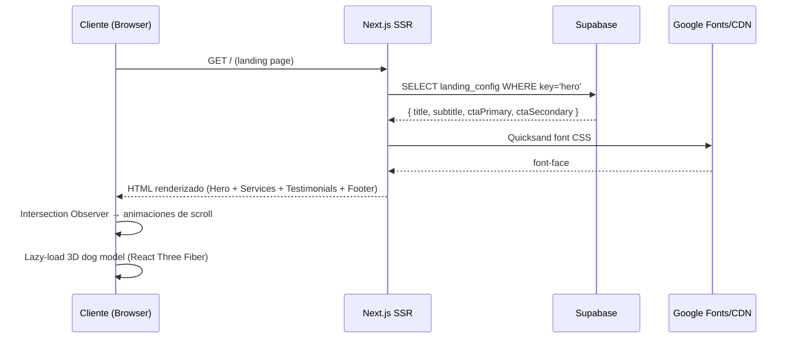

### FLOW-L2: Creación de Cita (Appointment Full Flow)

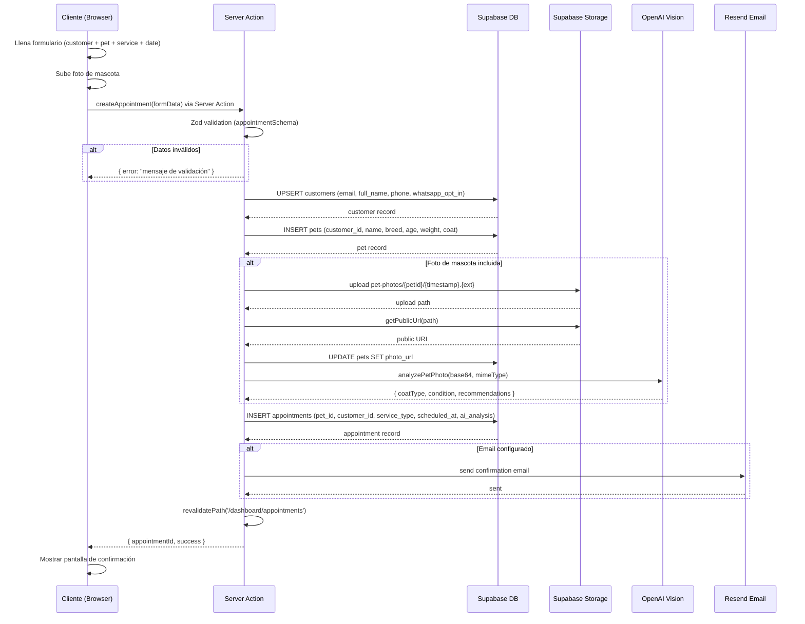

### FLOW-L3: Selección de Servicio con Watch Reactivo

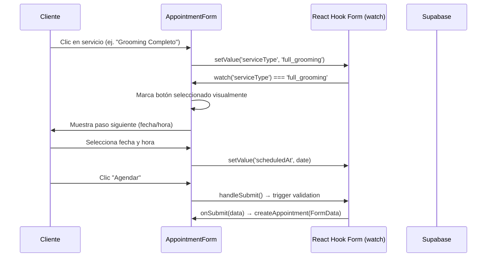

### FLOW-L4: Verificación de Geolocalización (Cobertura)

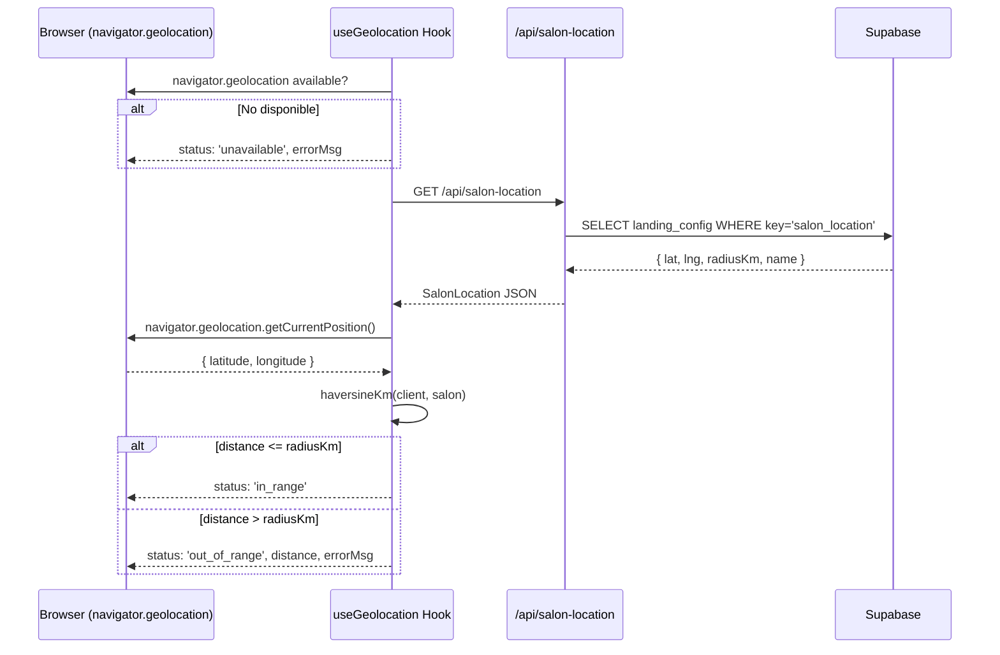

---

## 🔐 BACKOFFICE (Flujos Admin)

### FLOW-B1: Login (Supabase Auth)

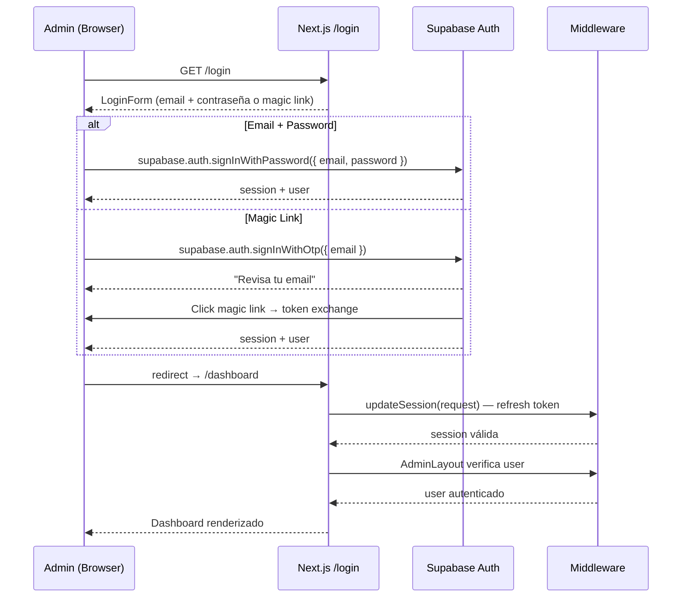

### FLOW-B2: Dashboard (Vista General)

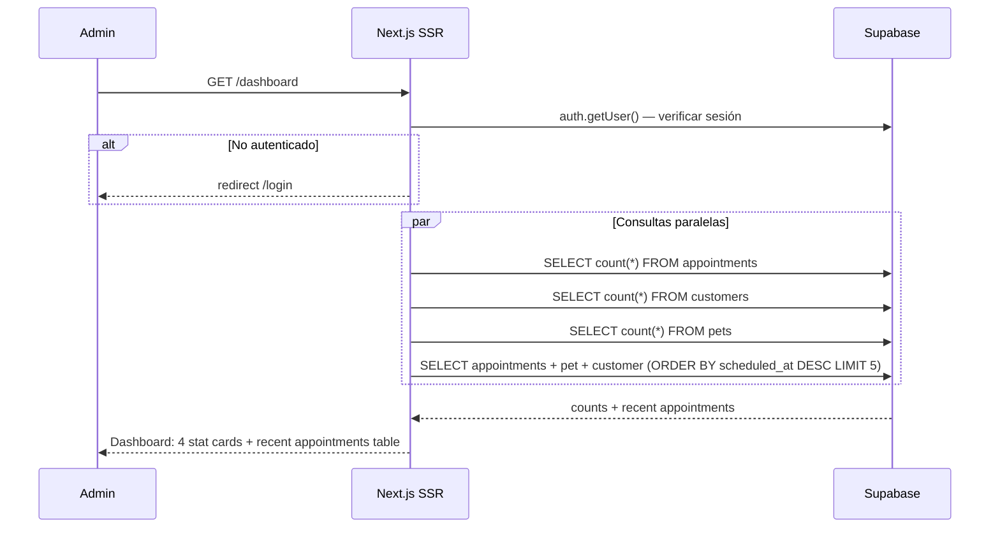

### FLOW-B3: Gestión de Citas (Appointments Admin)

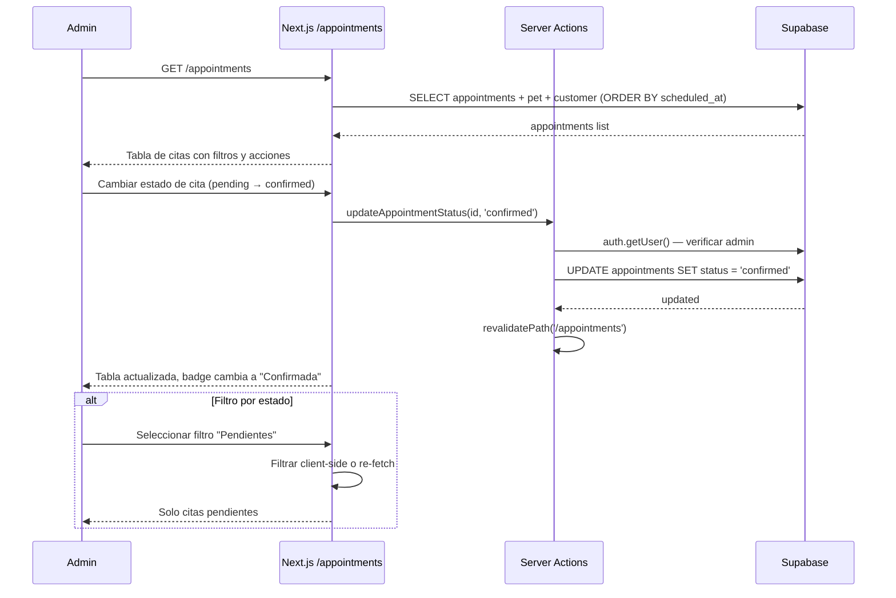

### FLOW-B4: Gestión de Clientes

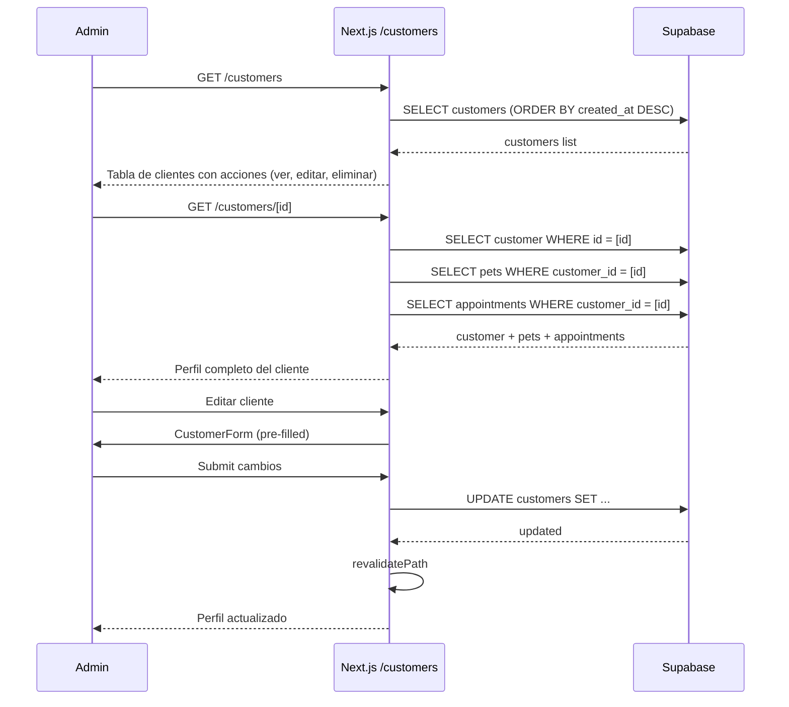

### FLOW-B5: Gestión de Productos

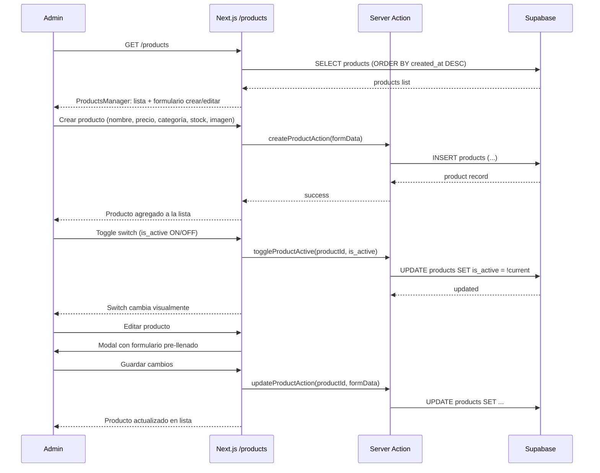

### FLOW-B6: CMS — Editor de Contenido

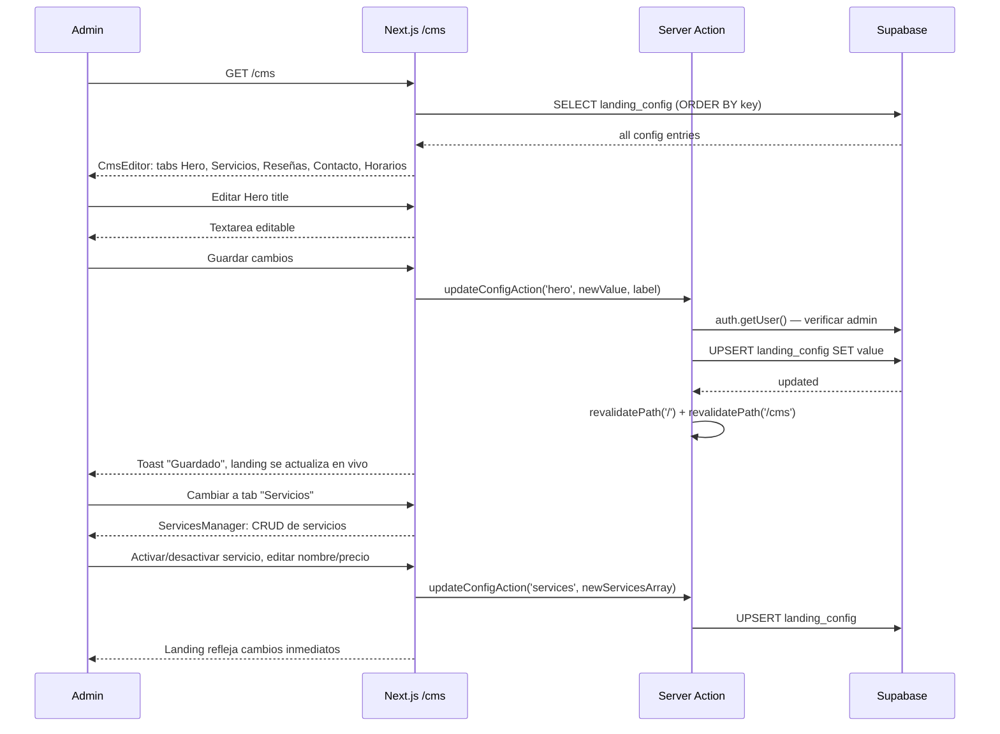

### FLOW-B7: Form Builder — Configuración de Formulario

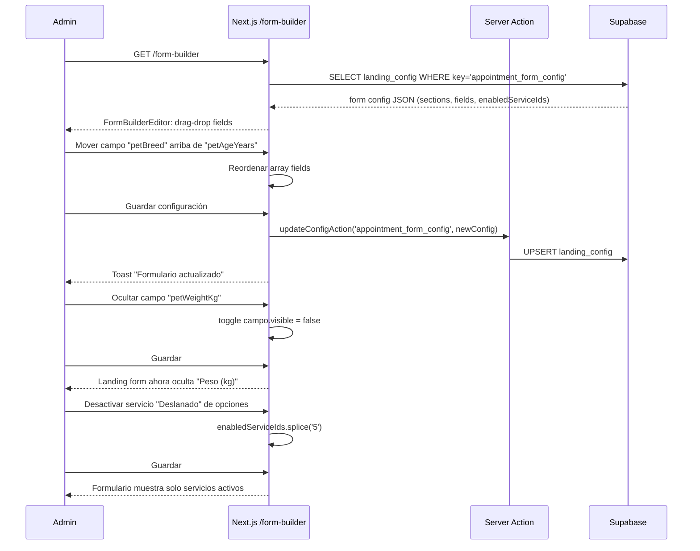

### FLOW-B8: Settings (Configuración General)

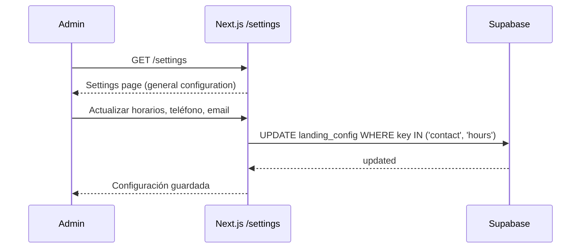

---

## 🔌 API (Endpoints Externos)

### FLOW-A1: Form Config API

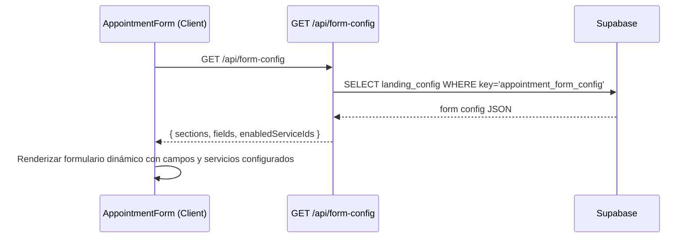

### FLOW-A2: Salon Location API

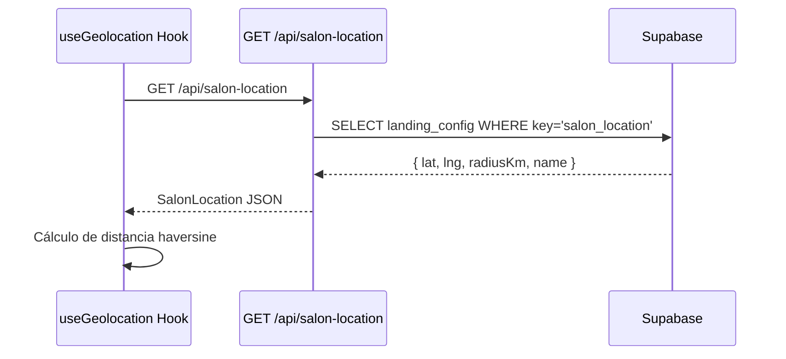

### FLOW-A3: WhatsApp Webhook (Inbound)

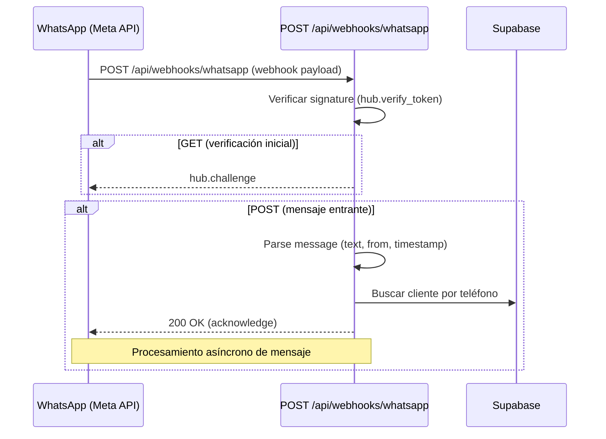

---

## 📊 Mapa de Flujos Completo

```
Paws & Glow
├── 🌐 LANDING (Público)
│   ├── FLOW-L1: Navegación landing (Hero → Services → Testimonials → Booking → Footer)
│   ├── FLOW-L2: Creación de cita completa (Customer → Pet → Service → AI → Appointment)
│   ├── FLOW-L3: Selección reactiva de servicio (React Hook Form watch)
│   └── FLOW-L4: Verificación de geolocalización (cobertura de servicio)
│
├── 🔐 BACKOFFICE (Admin autenticado)
│   ├── FLOW-B1: Login (Supabase Auth → Magic Link / Password)
│   ├── FLOW-B2: Dashboard (Stats + citas recientes)
│   ├── FLOW-B3: Gestión de citas (Lista + filtro + cambio de estado)
│   ├── FLOW-B4: Gestión de clientes (CRUD + historial mascotas/citas)
│   ├── FLOW-B5: Gestión de productos (CRUD + toggle activo)
│   ├── FLOW-B6: CMS Editor (Hero, Servicios, Reseñas, Contacto, Horarios)
│   ├── FLOW-B7: Form Builder (Configuración drag-drop del formulario de citas)
│   └── FLOW-B8: Settings (Configuración general)
│
└── 🔌 API (Endpoints externos)
    ├── FLOW-A1: GET /api/form-config → Configuración dinámica del formulario
    ├── FLOW-A2: GET /api/salon-location → Datos de ubicación del local
    └── FLOW-A3: POST /api/webhooks/whatsapp → Webhook entrante WhatsApp
```

---

_Generado por Kurama 🍥 — 2026-04-29_
